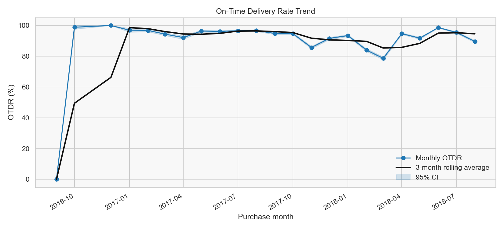
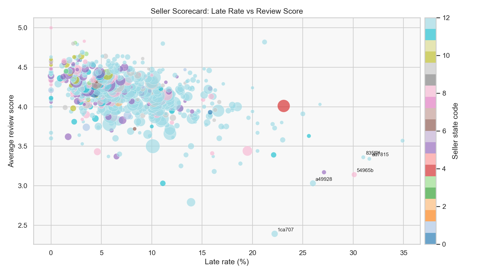
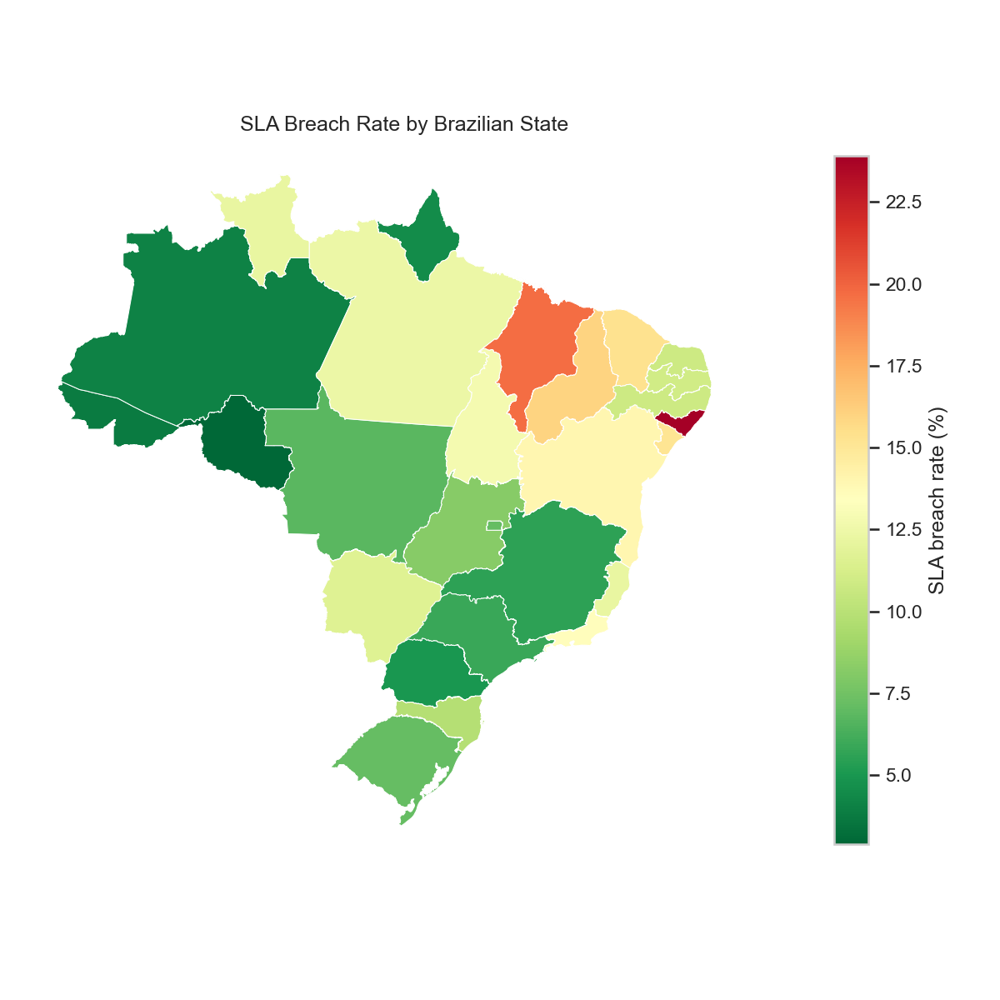
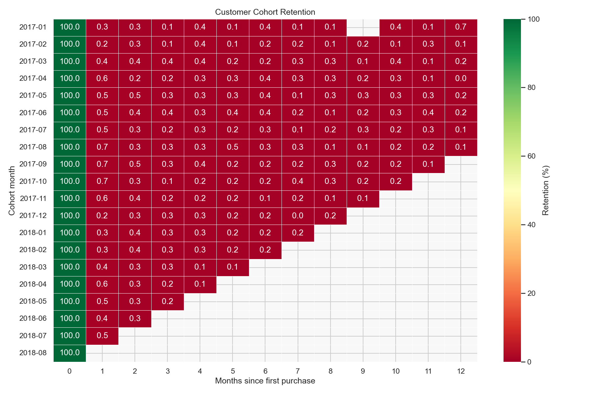

# SQL Operations Analytics: Olist Supply Chain

End-to-end SQL-first operations analytics project on the Olist Brazilian E-Commerce dataset. The project builds a DuckDB analytics layer, validates the schema, computes supply-chain and customer operations KPIs, generates a dashboard, and converts the analysis into quantified operational recommendations.

## Executive Snapshot

| Area | Result |
|---|---:|
| Delivered orders analyzed | 96,470 |
| Raw order table retained | 97.01% |
| Overall on-time delivery rate | 91.89% |
| Worst operational OTDR month | 2018-03 at 78.64% |
| Bottom-decile seller SLA breach share | 17.0% |
| Bottom-decile seller order share | 8.4% |
| Month-1 retention | 0.47% |
| Month-3 retention | 0.25% |
| Highest-risk corridor | SP -> MA |

## Dashboard Preview

### On-Time Delivery Trend



### Seller Reliability Outliers



### Geographic SLA Risk



### Cohort Retention



## What This Project Demonstrates

- SQL warehouse design in DuckDB across 8 raw operational tables.
- Production-style KPI views with explicit grain control and validation checks.
- Supply-chain analytics: OTDR, SLA breach, lead time, seller reliability, freight efficiency, and product velocity.
- Customer operations analytics: cohort retention and repeat-order economics.
- Python dashboarding with Matplotlib and Seaborn.
- Business synthesis with quantified operational recommendations.

## KPI Coverage

| KPI | Output |
|---|---|
| On-time delivery rate by month | `queries/01_kpi_otdr_monthly.sql` |
| Lead time by product category | `queries/02_kpi_lead_time_category.sql` |
| Seller performance scorecard | `queries/03_kpi_seller_scorecard.sql` |
| SLA breach rate by geography | `queries/04_kpi_sla_breach_geo.sql` |
| Customer cohort retention | `queries/05_kpi_cohort_retention.sql` |
| Order volume and GMV trend | `queries/06_kpi_volume_trend.sql` |
| Product velocity and inventory proxy | `queries/07_kpi_product_velocity.sql` |
| Delivery cost efficiency | `queries/08_kpi_freight_efficiency.sql` |

## Repository Structure

```text
sql_ops_analytics/
|-- build_project.py
|-- sql_ops_analytics.ipynb
|-- queries/
|   |-- 00_setup_and_clean.sql
|   |-- 01_kpi_otdr_monthly.sql
|   |-- 02_kpi_lead_time_category.sql
|   |-- 03_kpi_seller_scorecard.sql
|   |-- 04_kpi_sla_breach_geo.sql
|   |-- 05_kpi_cohort_retention.sql
|   |-- 06_kpi_volume_trend.sql
|   |-- 07_kpi_product_velocity.sql
|   `-- 08_kpi_freight_efficiency.sql
|-- outputs/
|   |-- kpi_summary.csv
|   |-- schema_validation.txt
|   |-- plot_01_otdr_trend.png
|   `-- plot_*.png
|-- docs/
|   `-- methodology.md
|-- summary.md
|-- requirements.txt
|-- LICENSE
`-- README.md
```

## Key Findings

### 1. Seller Reliability Is Concentrated

Bottom-decile sellers account for 17.0% of seller-scorecard SLA breaches while representing only 8.4% of scored seller order volume. A vendor tiering policy using delivery reliability and review quality would focus remediation on the sellers with the largest operational impact.

### 2. Geographic SLA Risk Needs Lane-Level Action

AL has the highest state breach rate at 23.9% across 397 delivered orders. The analysis points to long-haul state/category lanes where regional carrier coverage or revised SLA promises should be tested before applying national delivery rules.

### 3. Retention Drops Immediately After First Purchase

Average retention drops sharply after first purchase: month-1 0.47%, month-3 0.25%, and month-6 0.26%. Post-delivery re-engagement and second-purchase freight incentives would target the largest repeat-order gap.

## Reproduce the Analysis

Install dependencies:

```bash
pip install -r requirements.txt
```

Run the full pipeline:

```bash
python build_project.py
```

The script downloads the Olist dataset through KaggleHub, creates a local DuckDB database, executes all SQL views, exports KPI tables, regenerates plots, updates the notebook, and rewrites `summary.md`.

## Data Notes

- Source dataset: Olist Brazilian E-Commerce public dataset on Kaggle.
- Raw CSVs and the local DuckDB database are excluded from Git to keep the repository lightweight.
- All SQL KPI scripts are standalone from the `queries/` directory after `00_setup_and_clean.sql` creates the base tables and `orders_clean` view.
- See `docs/methodology.md` for metric definitions, validation gates, grain decisions, and assumptions.
