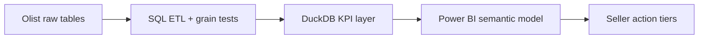

# Architecture

```mermaid
flowchart LR
    N0["Olist raw tables"] --> N1["SQL ETL + grain tests"]
    N1["SQL ETL + grain tests"] --> N2["DuckDB KPI layer"]
    N2["DuckDB KPI layer"] --> N3["Power BI semantic model"]
    N3["Power BI semantic model"] --> N4["Seller action tiers"]
    N4["Seller action tiers"]
```

## Claim boundary

Real public data; dashboard and KPI validation are local portfolio artifacts.
